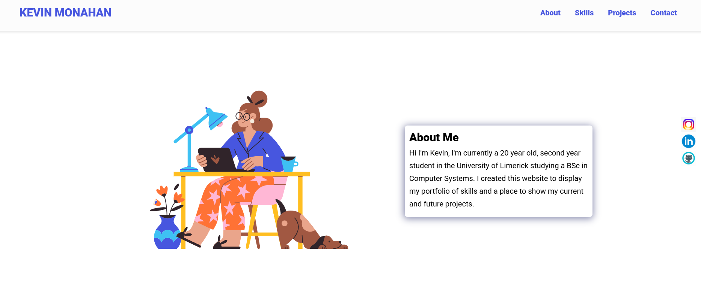

# DEVELOPER PORTFOLIO

This is a quick readMe explaining the features used in my developer portfolio and how I created it.

## Author

[@KevinMonahan](https://www.instagram.com/kevin.monahan3)

## Github repo

This is the [link](https://github.com/KevinMonahan3/KevinMonahan3.github.io.git) to the Github repo of the project

## Tech Stack

**Client:** HTML, CSS, Vanilla JavaSCript

## Tools Used

Below are are list of tools used, and the precise things they were used for:

- [Ion Icons](https://ionic.io/ionicons) for hambuger menu bar
- [Drawkit](https://www.drawkit.io/) for Jane Doe illustration
- [Icon8](https://icons8.com/) for animated icons and skills icons
- [Animate CSS](https://animate.style/) for Jane Doe's bio text animation
- [Formspree](https://formspree.io/) for contact form submision and straight delivery to Gmail

## Folder Structure

The index.html and readme files are in the root folder, alongside the screenshot included in the readme.

The assets folder contains the CSS and JavaScript files, all images and icons used, in their respective folders.

## Acknowledgements

- [Awesome Readme Templates](https://awesomeopensource.com/project/elangosundar/awesome-README-templates)
- [Awesome README](https://github.com/matiassingers/awesome-readme)
- [How to write a Good readme](https://bulldogjob.com/news/449-how-to-write-a-good-readme-for-your-github-project)
